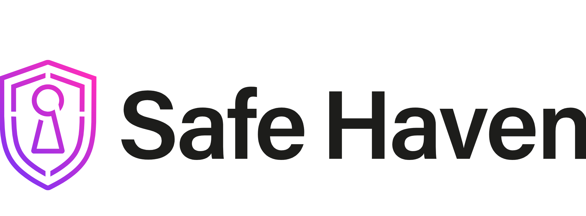

<!-- Main Logo at 65% Size -->   

       

<!-- Large Overview Image with Full Width (Max 800px) -->

<!-- Small Logo Above Address at 15% Size, Aligned Left -->

    
    

        **SafeHaven Cybersecurity** 
        1234 Cyber St, Secure City, SC 56789
    

---

# Welcome to SafeHaven Cybersecurity ISMS

Welcome to the **SafeHaven Cybersecurity Information Security Management System (ISMS)** website! This site provides an overview of our cybersecurity policies, standards, and practices to protect sensitive data and manage cybersecurity risks effectively.

---

## Introduction

At SafeHaven, we are dedicated to providing cybersecurity solutions tailored for small businesses. Our goal is to make robust security accessible and manageable, allowing organizations to focus on growth while we take care of security.

---

## Why Choose SafeHaven

SafeHaven Cybersecurity is uniquely positioned to address the security needs of small businesses. Here’s why we stand out:

- **Expertise**: Our team comprises cybersecurity professionals with extensive industry experience.
- **Tailored Solutions**: We design security frameworks specifically for small businesses, ensuring scalability and effectiveness.
- **Compliance-Focused**: Our ISMS aligns with industry standards like HIPAA, PCI-DSS, FFIEC, and SOC 2, ensuring compliance and security.
- **24/7 Support**: We provide continuous monitoring and support for swift and effective incident response.

Choose SafeHaven for a reliable, comprehensive approach to cybersecurity.

---

## Mission Statement

Our mission at SafeHaven Cybersecurity is to empower small businesses by safeguarding their digital assets through comprehensive, scalable, and affordable security solutions.

We are committed to:

- **Protecting Data**: Ensuring your data remains confidential, integral, and available.
- **Mitigating Risks**: Proactively assessing and managing cybersecurity risks to minimize threats.
- **Promoting Compliance**: Aligning with industry standards to help businesses stay compliant with regulations and build client trust.
- **Fostering Resilience**: Creating a culture of cybersecurity awareness, enabling swift and effective incident recovery.

SafeHaven Cybersecurity – making security simple, strong, and sustainable.

---

Explore our policies, compliance standards, and operational security strategies to understand how we protect your business.
